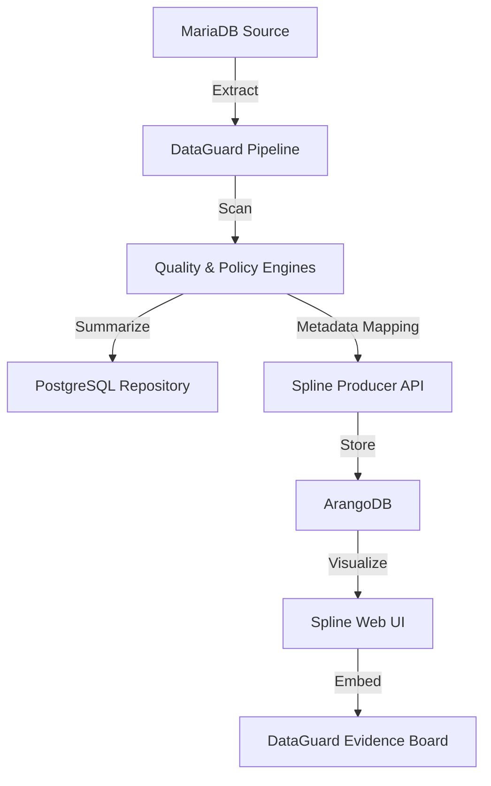

# 🛡️ DataGuard: Advanced Data Governance & Lineage Platform

DataGuard is a high-performance, privacy-first Data Governance platform designed to monitor, audit, and visualize data quality and policy compliance across distributed data sources.


---

## 🌟 Core Features

-   **Live Data Pipeline:** Orchestrates real-time extraction and scanning from MariaDB/MySQL sources.
-   **Data Quality Engine:** Automated checks for completeness, accuracy, and formatting (emails, phone numbers, UUIDs).
-   **Policy Compliance:** Published governance policies automatically applied during every scan.
-   **Automated Data Lineage:** Full visual flow mapping using **Spline**, showing data movement from Source → Engine → Target.
-   **Evidence Board:** A unified centralized portal to review scan history and lineage graphs.
-   **Zero-Raw-Data Privacy:** Raw data rows are processed in-memory and discarded immediately; only aggregate scores reach the audit repository.

---

## 🏗️ Architecture

### Tech Stack
-   **Frontend:** React (Vite), JavaScript, Vanilla CSS (Obsidian Control Design System).
-   **Backend:** FastAPI (Python), SQLAlchemy, Pydantic.
-   **Data Storage:** PostgreSQL (System Repository), ArangoDB (Lineage Repository).
-   **Lineage Stack:** Spline REST Server, Spline Web UI, Nginx Reverse Proxy.

### Component Map


---

## 🚀 Setup & Installation

### 1. Prerequisites
-   Docker & Docker Compose
-   Python 3.10+
-   Node.js 18+

### 2. Spline Lineage Stack
The lineage infrastructure is dockerized for stability:
```bash
# Start ArangoDB, Spline REST, and the Nginx Proxy
docker compose -f docker-compose.spline.yml up -d
```

### 3. Backend Setup
```bash
cd backend
pip install -r requirements.txt
uvicorn main:app --reload
```

### 4. Frontend Setup
```bash
cd frontend
npm install
npm run dev
```

---

## 🛠️ Configuration Detail: The Spline Proxy
To bypass browser **CORS security**, we use a custom Nginx reverse proxy (`nginx-spline.conf`). This unifies the Spline UI and API under a single port (**9090**), ensuring the lineage graph renders without browser blocks.

- **Unified Port:** `http://localhost:9090`
- **Internal Mapping:**
    - `/` → Spline Web UI
    - `/consumer/` → Spline REST Service

---

## 📂 Project Structure

```text
├── backend/
│   ├── engines/            # Core logic: quality, policy, and spline push
│   ├── routers/            # API endpoints (Pipeline, Auth, Connectors)
│   ├── models.py           # Database schemas (PostgreSQL)
│   └── database.py         # SQLAlchemy connection management
├── frontend/
│   ├── src/
│   │   ├── components/     # UI Elements (LineageGraph, EvidenceBoard)
│   │   ├── pages/          # Full page views
│   │   └── api/            # API client configuration
├── docker-compose.spline.yml # Lineage stack orchestration
└── nginx-spline.conf         # CORS-fix proxy configuration
```

---

## 🛡️ License
All rights reserved. Professional Data Governance Solution.
